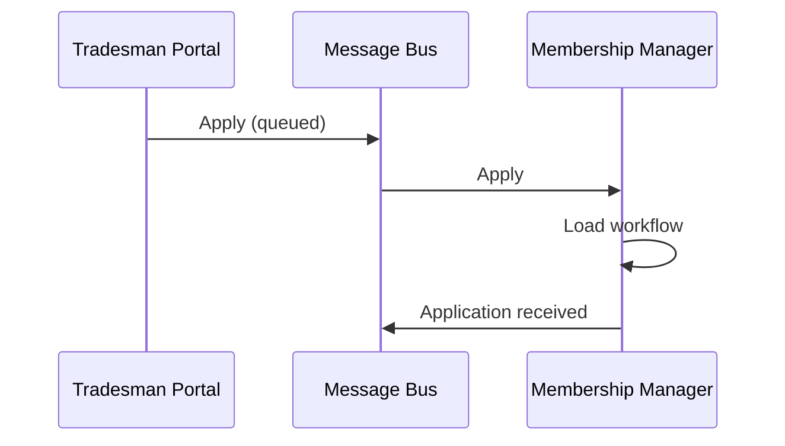

# Diagram Templates (Phase 5 polished rendering)

Canonical templates for the static architecture diagram and call-chain
diagrams. Use these in Phase 5 after the design has stabilized.

The skill produces **two formats** from the same conceptual coordinate
map. Pick one based on `d2` availability:

- **D2** when the `d2` CLI is on PATH (preferred — cleaner source,
  easier to edit)
- **SVG** otherwise (same visual output, more verbose source)

Never mix formats in the final report. If you fall back to SVG for the
static diagram, use SVG for every call chain too.

## The coordinate map

The whole point of polished rendering (vs. Mermaid) is **positional
consistency** — every component sits in the same row and column in
every diagram for a given system. This is what makes Phase 4's symmetry
check legible.

The map is:

| Row | Layer            | Notes                                                  |
|-----|------------------|--------------------------------------------------------|
| 1   | Client           | Entry-point components (UIs, APIs, schedulers)         |
| 2   | Managers         | Workflow Managers                                      |
| 3   | Engines          | Activity Engines (often fewer than Managers)           |
| 4   | ResourceAccess   | One per logical Resource cluster                       |
| 5   | Resources        | Databases, external systems, queues                    |

The **Utilities bar** sits as a vertical column on the right, parallel
to rows 1–3 typically.

**Within each layer**: components are ordered left-to-right by some
stable criterion the user controls (alphabetical, or by subsystem
grouping, or by the order they appeared in the volatility analysis).
Once chosen, the order **must not change between diagrams** in the
same session. Same `MembershipManager` in column 1 of row 2 in every
single chain.

## D2 templates

### `static.d2` — Layered architecture

```d2
# TradeMe-shaped example. Substitute your own components in each grid.
# Order WITHIN a grid is the canonical left-to-right order for this
# system — every call-chain file must list these in the same order.

direction: down

grid: {
  grid-rows: 5
  grid-gap: 24
  horizontal-gap: 18

  client: {
    label: "CLIENT"
    grid-columns: 4
    tradesman-portal: "Tradesman Portal"
    contractors-portal: "Contractors Portal"
    marketplace-app: "Marketplace App"
    timer: "Timer"
  }

  managers: {
    label: "MANAGERS"
    grid-columns: 3
    membership-manager: "Membership Manager"
    market-manager: "Market Manager"
    education-manager: "Education Manager"
  }

  engines: {
    label: "ENGINES"
    grid-columns: 2
    regulation-engine: "Regulation Engine"
    search-engine: "Search Engine"
  }

  access: {
    label: "RESOURCE ACCESS"
    grid-columns: 5
    members-access: "Members Access"
    projects-access: "Projects Access"
    payments-access: "Payments Access"
    regulations-access: "Regulations Access"
    workflows-access: "Workflows Access"
  }

  resources: {
    label: "RESOURCES"
    grid-columns: 5
    members: { shape: cylinder; label: "Members" }
    projects: { shape: cylinder; label: "Projects" }
    payments: { shape: cylinder; label: "Payments" }
    regulations: { shape: cylinder; label: "Regulations" }
    workflows: { shape: cylinder; label: "Workflows" }
  }
}

utilities: {
  label: "UTILITIES"
  grid-rows: 4
  security: "Security"
  message-bus: "Message Bus"
  logger: "Logger"
}

# No arrows on the static diagram. Layer membership conveys the call
# direction (top layer calls into the layer below it; everything can
# call Utilities). Arrows are reserved for call-chain diagrams where
# they show the specific path of one use case.
```

### `callchain-{usecase-slug}.d2` — Per-use-case call chain

Same grid layout as `static.d2`, with two changes:
1. Active components get the `active` class.
2. Per-component arrows show the call path (instead of layer-level
   arrows).

```d2
# Add Tradesman call chain. Notice the grid IS IDENTICAL to static.d2
# — only the styling and the arrow set differ.

direction: down

classes: {
  active: {
    style: {
      fill: "#dbeafe"
      stroke: "#1f2937"
      stroke-width: 2
    }
  }
  faded: {
    style: {
      opacity: 0.35
    }
  }
  bus-active: {
    style: {
      fill: "#fef3c7"
      stroke: "#1f2937"
      stroke-width: 2
    }
  }
}

grid: {
  grid-rows: 5
  grid-gap: 24
  horizontal-gap: 18

  client: {
    label: "CLIENT"
    grid-columns: 4
    tradesman-portal: { label: "Tradesman Portal"; class: active }
    contractors-portal: { label: "Contractors Portal"; class: faded }
    marketplace-app: { label: "Marketplace App"; class: faded }
    timer: { label: "Timer"; class: faded }
  }

  managers: {
    label: "MANAGERS"
    grid-columns: 3
    membership-manager: { label: "Membership Manager"; class: active }
    market-manager: { label: "Market Manager"; class: faded }
    education-manager: { label: "Education Manager"; class: faded }
  }

  engines: {
    label: "ENGINES"
    grid-columns: 2
    regulation-engine: { label: "Regulation Engine"; class: active }
    search-engine: { label: "Search Engine"; class: faded }
  }

  access: {
    label: "RESOURCE ACCESS"
    grid-columns: 5
    members-access: { label: "Members Access"; class: active }
    projects-access: { label: "Projects Access"; class: faded }
    payments-access: { label: "Payments Access"; class: active }
    regulations-access: { label: "Regulations Access"; class: active }
    workflows-access: { label: "Workflows Access"; class: active }
  }

  resources: {
    label: "RESOURCES"
    grid-columns: 5
    members: { shape: cylinder; label: "Members" }
    projects: { shape: cylinder; label: "Projects"; class: faded }
    payments: { shape: cylinder; label: "Payments" }
    regulations: { shape: cylinder; label: "Regulations" }
    workflows: { shape: cylinder; label: "Workflows" }
  }
}

utilities: {
  label: "UTILITIES"
  grid-rows: 4
  security: { label: "Security"; class: faded }
  message-bus: { label: "Message Bus"; class: bus-active }
  logger: { label: "Logger"; class: faded }
}

# Specific call path.  Solid = synchronous, "queued" label + dashed
# style = queued/async.
grid.client.tradesman-portal -> utilities.message-bus: "queued" {
  style.stroke-dash: 4
}
utilities.message-bus -> grid.managers.membership-manager
grid.managers.membership-manager -> grid.engines.regulation-engine
grid.managers.membership-manager -> grid.access.members-access
grid.managers.membership-manager -> grid.access.payments-access
grid.managers.membership-manager -> grid.access.workflows-access
grid.engines.regulation-engine -> grid.access.regulations-access
grid.access.members-access -> grid.resources.members
grid.access.payments-access -> grid.resources.payments
grid.access.regulations-access -> grid.resources.regulations
grid.access.workflows-access -> grid.resources.workflows
```

Render with:

```bash
d2 diagrams/static.d2 diagrams/static.svg
d2 diagrams/callchain-add-tradesman.d2 diagrams/callchain-add-tradesman.svg
```

## SVG fallback templates

When `d2` isn't available, emit SVG directly using the same coordinate
map. SVG is more verbose but produces an identical visual result.

### Sizing rules

For a system with up to 5 components in any one layer:
- Canvas: `980 × 380`
- Component box: `width = (canvas_main_width - margins) / max_layer_cols`,
  height = `36`
- Layer band heights: 60px each (row 1 at y=30, row 2 at y=90, row 3 at
  y=150, row 4 at y=210, row 5 at y=280)
- Layer label column at `x=32` (left, anchored start)
- Main grid: `x=110 → x=800`
- Utilities sidebar: `x=830 → x=950`

If any layer has more than 5 components, widen the canvas or split the
system into subsystems (multiple Manager-led vertical slices, one
diagram per subsystem).

### `static.svg` template

```xml
<svg width="980" height="380" viewBox="0 0 980 380" xmlns="http://www.w3.org/2000/svg" font-family="-apple-system, system-ui, sans-serif" font-size="11">
  <style>
    .box { fill: white; stroke: #1f2937; stroke-width: 1.5; rx: 4; }
    .label { fill: #6b7280; font-size: 10px; font-weight: 600; letter-spacing: 0.08em; }
    .util-box { fill: #fef3c7; stroke: #1f2937; stroke-width: 1.5; rx: 4; }
    .res { fill: #f3f4f6; stroke: #1f2937; stroke-width: 1.5; rx: 0; }
    .arrow { stroke: #1f2937; stroke-width: 1.5; fill: none; marker-end: url(#arr); }
    text { dominant-baseline: middle; text-anchor: middle; }
  </style>
  <defs>
    <marker id="arr" viewBox="0 0 10 10" refX="9" refY="5" markerWidth="8" markerHeight="8" orient="auto">
      <path d="M0,0 L10,5 L0,10 Z" fill="#1f2937"/>
    </marker>
  </defs>

  <!-- Layer labels (left column) -->
  <text x="32" y="48"  class="label" text-anchor="start">CLIENT</text>
  <text x="32" y="108" class="label" text-anchor="start">MANAGERS</text>
  <text x="32" y="168" class="label" text-anchor="start">ENGINES</text>
  <text x="32" y="228" class="label" text-anchor="start">ACCESS</text>
  <text x="32" y="298" class="label" text-anchor="start">RESOURCES</text>

  <!-- Layer separators -->
  <line x1="110" y1="40"  x2="800" y2="40"  stroke="#e5e7eb" stroke-dasharray="2,2"/>
  <line x1="110" y1="100" x2="800" y2="100" stroke="#e5e7eb" stroke-dasharray="2,2"/>
  <line x1="110" y1="160" x2="800" y2="160" stroke="#e5e7eb" stroke-dasharray="2,2"/>
  <line x1="110" y1="220" x2="800" y2="220" stroke="#e5e7eb" stroke-dasharray="2,2"/>
  <line x1="110" y1="290" x2="800" y2="290" stroke="#e5e7eb" stroke-dasharray="2,2"/>

  <!-- COMPONENTS: emit one <rect>+<text> pair per component in each
       layer. Position x = 130 + (column_index * (box_width + gap)).
       For 5-wide layers: box_width=125, gap=10.
       For 4-wide layers: box_width=160, gap=10. -->

  <!-- (Component rects + labels go here, generated from the
       component list — see the demo HTML for a concrete example) -->

  <!-- Utilities sidebar -->
  <text x="868" y="20" class="label">UTILITIES</text>
  <!-- (Utility rects + labels at x=830, width=120, stepping y by 44) -->

  <!-- No arrows on the static diagram. Layer membership conveys the
       call direction; arrows are reserved for call-chain diagrams. -->
</svg>
```

### `callchain-{slug}.svg` template

Identical to `static.svg` but with three changes:
1. Active components use `class="box-active"` (filled blue) or
   `class="util-box"` (filled amber for active Utilities).
2. Inactive components wrap in `<g class="faded">` (35% opacity).
3. Layer-level arrows are replaced by **per-component arrows** showing
   the actual call path.

Additional styles:

```xml
<style>
  .box-active     { fill: #dbeafe; stroke: #1f2937; stroke-width: 2; rx: 4; }
  .res-active     { fill: #f3f4f6; stroke: #1f2937; stroke-width: 2; rx: 0; }
  .util-box-active { fill: #fef3c7; stroke: #1f2937; stroke-width: 2; rx: 4; }
  .arrow-queued   { stroke: #6b7280; stroke-width: 1.5; fill: none;
                    stroke-dasharray: 5,3; marker-end: url(#arr-gray); }
  .faded          { opacity: 0.35; }
</style>
<defs>
  <marker id="arr-gray" viewBox="0 0 10 10" refX="9" refY="5"
          markerWidth="8" markerHeight="8" orient="auto">
    <path d="M0,0 L10,5 L0,10 Z" fill="#6b7280"/>
  </marker>
</defs>
```

Arrow types:
- **Synchronous**: `<line ... class="arrow"/>` (solid black)
- **Queued / async**: `<path ... class="arrow-queued"/>` (dashed gray)
  — use `<path>` rather than `<line>` so you can curve around other
  components (especially for Client → MessageBus and MessageBus →
  Manager, which traverse the diagram diagonally)

## Customization notes

### Subsystem splits

If any layer has more than ~7 components, split the system into
subsystems (per the Phase 3 rule of ≤3 Managers per subsystem). Render
**one diagram per subsystem** plus a high-level system overview, rather
than one mega-diagram.

The coordinate map stays the same within each subsystem.

### When a Resource is itself a system

External Resources (payment providers, partner APIs) appear in the
Resources row with a different visual treatment to distinguish them
from internal storage. Suggested:
- Internal Resources: gray rectangle with sharp corners
  (`<rect class="res">`)
- External Resources: gray rectangle with a small "external" badge or
  a hexagonal shape (`shape: hexagon` in D2, `<polygon>` in SVG)

### Sequence diagrams (optional, for complex call chains)

When a call chain has order-sensitive interactions (e.g., the second
Manager's processing depends on the first publishing an event), a
sequence diagram is clearer than a call chain. Both D2 and Mermaid
support sequence diagrams; Mermaid is fine here even in the final
report because sequence diagrams don't suffer from the layout-drift
problem that pushes call chains to D2/SVG.

D2:

```d2
shape: sequence_diagram

client: "Tradesman Portal"
bus: "Message Bus"
mgr: "Membership Manager"

client -> bus: "Apply (queued)"
bus -> mgr: "Apply"
mgr -> mgr: "Load workflow"
mgr -> bus: "Application received"
```

Mermaid (acceptable in the final report for sequence diagrams):



### Color palette

The skill uses a consistent palette across both formats:

| Use                        | Color     |
|----------------------------|-----------|
| Box stroke / arrows / text | `#1f2937` |
| Layer separators / faded   | `#e5e7eb` |
| Layer labels / dashed gray | `#6b7280` |
| Active component fill      | `#dbeafe` |
| Active utility fill        | `#fef3c7` |
| Resource fill              | `#f3f4f6` |

Don't introduce additional colors. The visual vocabulary should be:
black/gray for structure and call paths, one blue for active service
components, one amber for active utilities/buses, neutral gray for
Resources.
