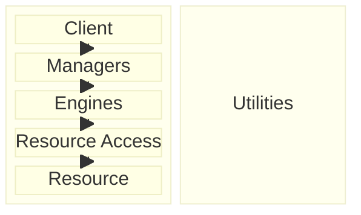

# Volatility-Based Decomposition (DEPRECATED)

> [!WARNING]
> **This skill is deprecated.** Use
> [`righting-software-system-design`](../righting-software-system-design/SKILL.md)
> instead — a more faithful and complete implementation of Juval Löwy's
> iDesign methodology from *Righting Software*.
>
> What the new skill corrects and adds:
> - **Volatility axes**: Löwy's book defines two axes (same customer
>   over time / different customers at the same point in time), not the
>   five (Requirements / Technology / Integration / Data / Policy) that
>   this skill uses. The five-axes framework appears to be a community
>   / conference-talk artifact, not from the book.
> - **Naming**: the suffix is `Access` (e.g., `PaymentsAccess`), not
>   `Accessor`. This skill uses `Accessor` throughout, which doesn't
>   match the book.
> - **Missing methodology**: the new skill adds the
>   Vision → Objectives → Mission framing, the Four Questions,
>   core-use-case identification, solutions-masquerading-as-requirements
>   peeling, the longevity heuristic, design-for-your-competitors
>   framing, the almost-expendable Manager test, the M:E ratio
>   heuristic, and call-chain validation — all from the book.
>
> This skill remains in the marketplace only so users can finish an
> in-progress decomposition started with it before deprecation. For
> new sessions, run `righting-software-system-design`.

A collaborative iDesign-style decomposition session. The skill interviews the
user about how their business actually works, surfaces axes of change, maps
volatile activities to the iDesign service hierarchy
(Managers → Engines → Accessors → Utilities), validates the proposed
decomposition against concrete change scenarios, and writes the result to a
recommendation report that can either scaffold a new system or guide a
refactor of an existing one.

The deeper goal is graceful handling of **unknown unknowns**: by encapsulating
each axis of change behind its own stable interface, the system can absorb
future requirements, technology, integration, data, and policy changes without
rippling them across components. You can't predict what will change, but you
can predict *what kinds of things* change — and structure accordingly.

## The Golden Rule

> Decompose by volatility, not by functionality.
>
> — Juval Löwy, *Righting Software*

This is not a guideline, it is THE RULE. Every proposed component must answer:
"What single axis of change does this encapsulate?" If the answer is a verb or
a use-case step (Validate, Price, Ship, Notify), the boundary is functional and
wrong. If the answer is a crisp axis of change (tax law, partner API,
pricing rule, regulator), the boundary is correct.

Why this matters: functional names describe what the system does *today*.
Volatility names describe why the system will change *tomorrow*. Functional
decomposition almost always loses on contact with reality — a single change
("VIPs skip validation for orders under $50") will touch Validation, Pricing,
and Notification simultaneously. A volatility cut puts it behind a single
`BusinessRulesEngine`. Hold the line on this rule throughout the session.

## When to suggest this workflow

When you detect a task that involves:
- Designing a new system from scratch
- Splitting a monolith or extracting services
- Recurring "every change touches everything" pain
- Architectural ambiguity about service boundaries
- Decisions you'd want to defend with a written rationale

Suggest it naturally: "Sounds like a volatility-based decomposition would help
here. Want me to walk you through it? It's an interview — I'll ask about your
business processes and we'll build up a component recommendation together."

If the user declines, respect that and proceed normally.

## Starting a session

Before anything else, suggest a short kebab-case name for the system being
decomposed. For example, if the user says "I'm trying to figure out how to
structure our order pipeline", suggest `order-pipeline`. Let the user
override.

Then ask one question: **is this a new system, or are we decomposing an
existing one?** The methodology is the same, but the framing of the final
report differs (greenfield gets a build sequence; refactor gets a
current → target mapping with extraction priorities).

All persistent artifacts then live in `decompositions/{system-name}/`:

| File | Purpose |
|------|---------|
| `decompositions/{system-name}/report.md` | The growing recommendation report — the headline artifact |
| `decompositions/{system-name}/processes.md` | (Optional) raw process walkthroughs, if Phase 1 grows long |

Write everything important to `report.md` as the session progresses. Chat is
the conversation surface; the file is the durable record.

---

## Phase 1: Business Process Walkthrough

**Goal**: Document how the business actually works, *before* analyzing
anything. Volatility is discovered through process analysis, not by asking
"what changes?" directly. Asking that question up front gets you opinions;
walking the processes gets you evidence.

Ask the user: **"What are the core business processes this system supports?"**
Get a list of names first (Order placement, Returns, Pricing updates, etc.).
Don't dive in yet.

Then take them **one at a time**. For each process, walk through it
end-to-end:

1. "Walk me through it from start to finish. What's the trigger? What happens
   next? What's the outcome?"
2. "Who's involved at each step? What decisions get made? What data flows
   in and out?"
3. "Are there variations or branches? When does the process go a different
   way?"
4. "What happens when things go wrong?"

Document each process in `report.md` under a `## Processes` section, as a
sequence:

```markdown
### Order placement
1. Customer submits order (web/API) → cart contents, customer ID, payment method
2. Validate inventory → branch to "out of stock" flow if needed
3. Calculate price (subtotal + tax + shipping + discounts)
4. Authorize payment → branch to "payment failed" flow if needed
5. Reserve inventory
6. Confirm to customer
7. Hand to fulfillment
```

If processes grow large, split them into `processes.md` and link from
`report.md`.

**Do not analyze or decompose yet.** Just document faithfully. The interview
loses information if you start proposing boundaries during walkthroughs — the
user starts answering for the boundary you proposed instead of describing
what actually happens.

**Stop and check in** before moving on:

> "I've documented the processes in `report.md`. Want to read through them
> and tell me if anything's missing or wrong? Once you're happy, we'll move
> to volatility analysis."

Wait for the user.

---

## Phase 2: Volatility Analysis

**Goal**: Identify what changes and why, across all processes. This is where
the decomposition is actually decided — Phases 3–4 just give it a name and
test it.

### Step 2a: Change history

Ask: **"In the last 12 months, what changed in these processes, and why?"**
And: **"What's on the roadmap for the next 6–12 months that will change
them?"** History and roadmap are the two best evidence sources for axes of
change. Speculation is the worst.

Capture the answers — at least the categories of change, even if specifics
are fuzzy.

### Step 2b: Surface the five axes

Walk the user through the five volatility axes. Don't lecture — just frame
the question for each one and let the user point at examples from their
own answers:

| Axis | What to ask |
|------|------|
| **Requirements** | "Which business rules change frequently? Discounts, eligibility, workflows?" |
| **Technology** | "Which technologies do you expect to replace? Frameworks, runtimes, hosting?" |
| **Integration** | "Which external systems have unstable APIs or might be swapped?" |
| **Data** | "Which schemas evolve? Customer records, product attributes, order shapes?" |
| **Policy** | "Which regulatory or compliance rules change? Tax, privacy, regional?" |

### Step 2c: Commonalities and ripple radius

Across all documented processes, look for:

- **Commonalities** — activities or logic appearing in multiple processes
  (candidates for shared Engines or Accessors)
- **Volatilities** — activities that change frequently or independently
  (candidates for encapsulation boundaries)

For each volatile activity, ask the ripple-radius question:
**"If this changes, what else has to change with it?"** Activities that
change for the *same reason* belong together; activities that change for
*different reasons* should be separated, even if they look related.

### Step 2d: Write the analysis

Add a `## Volatility Analysis` section to `report.md` containing:

- A short paragraph per axis, naming the specific things that vary on it
- A table of candidate volatility clusters (don't name components yet — just
  group the activities by reason-to-change)

Example:

```markdown
## Volatility Analysis

### Requirements volatility
Discount rules, VIP eligibility, return windows — changed 4× in the last
year, expected to change again with the loyalty program launch.

### Policy volatility
EU VAT rules, US state tax rates — out of our control, change on a
regulatory schedule.

### Candidate volatility clusters
| Cluster | Activities | Reason it changes |
|---------|-----------|-------------------|
| Pricing logic | discounting, promo codes, VIP pricing | Marketing experiments |
| Tax calculation | VAT, state sales tax, GST | Regulatory updates |
| Shipping integration | rate quotes, label printing, tracking | Partner swaps |
```

**Stop and check in**:

> "Here's the volatility analysis. Do these clusters match how change actually
> hits you? Anything I've split that should be merged, or merged that should
> be split?"

Wait for the user. Expect to iterate here — this is where the user's domain
knowledge has the most leverage.

---

## Phase 3: Component Definition

**Goal**: Map the validated volatility clusters to the iDesign service
hierarchy.

### The hierarchy

| Type | Responsibility | Depends on |
|------|---------------|-----------|
| **Managers** | Workflow orchestration, sequencing, state machines | Engines only |
| **Engines** | Business logic, rules, calculations, algorithms | Accessors, Utilities |
| **Accessors** | Data access, external integration, resource management | Utilities only |
| **Utilities** | Cross-cutting infrastructure (stateless) | Nothing |

### Dependency rules (non-negotiable)

- Top-down only: Managers → Engines → Accessors → Utilities
- No skip-level calls (a Manager cannot call an Accessor directly)
- No peer calls (Engine A cannot call Engine B)
- No bottom-up calls (an Accessor cannot call an Engine)
- Utilities are stateless and depend on nothing

Why these rules: each level encapsulates a different *kind* of volatility.
Managers absorb workflow change. Engines absorb business-logic change.
Accessors absorb data and integration change. Utilities absorb infrastructure
change. Letting an Engine call an Accessor directly is fine; letting a
Manager call an Accessor smuggles data-access concerns into workflow code, so
when the database changes, the Manager has to change too — exactly the
coupling the hierarchy exists to prevent.

### Mapping

For each volatility cluster from Phase 2, assign:

- **Workflow / sequencing volatility** → a **Manager**
- **Business rules / calculations** → an **Engine**
- **Data / external integration** → an **Accessor**
- **Cross-cutting infrastructure** → a **Utility**

Name each component after the volatility it encapsulates, not after what it
does today. `PricingEngine` is good (encapsulates pricing-rule volatility).
`OrderProcessor` is bad (functional, no axis). `ShippingPartnerAccessor` is
good (encapsulates partner-API volatility). `FedExClient` is bad
(implementation-specific — survives until you swap shippers, then you rename
or rewrite).

### Forbidden vocabulary at this stage

Don't let infrastructure names leak into component names: Lambda, ECS, SQS,
DynamoDB, S3, Kubernetes, Docker, Python, Node, Postgres, Redis. These are
deployment / runtime concerns and they belong in a separate document. A
component called `LambdaInvoker` is decomposed by infrastructure, not by
volatility — push back if the user suggests one and offer a volatility-axis
name instead.

### Write the component list

Add a `## Components` section to `report.md`. Lead with a Mermaid layered
diagram (template below), then follow with one table per tier filling in the
details. The diagram is the visual TL;DR; the tables carry the substance.

#### Diagram template

Use a Mermaid `block-beta` diagram in the canonical iDesign layered layout —
Client → Manager → Engine → Resource Access → Resource stacked top-to-bottom,
with Utilities as a sidebar on the right (consumed from any layer). Arrows go
top-down only and are drawn at the layer level, not between individual
components — layer membership already conveys the per-component relationship,
and per-node arrows clutter the diagram without adding information.

Client and Resource appear in the diagram even though they aren't components
you're designing — they're the boundaries the decomposition lives between.
Listing them makes it clear what the system talks *to* (Resources: databases,
partner APIs) and what it talks *through* (Clients: web, API, scheduler,
inbound webhooks).

Populate every inner block with at least one node before rendering — some
`block-beta` renderers drop the layer label (Client, Managers, …) on blocks
that contain only comments.



Tune the inner `columns N` per layer to fit how many components live there —
3-5 is usually the right grain. If a single layer has more than ~7 components,
the diagram is getting hard to read and the system probably wants a
sub-domain split (one block diagram per bounded subdomain, with a high-level
overview diagram above).

#### Component tables

Beneath the diagram, list each tier in detail:

```markdown
## Components

### Managers
| Component | Encapsulates | Notes |
|-----------|--------------|-------|
| OrderManager | The order workflow sequence | Owns the state machine; no business logic |

### Engines
| Component | Encapsulates | Depends on |
|-----------|--------------|-----------|
| PricingEngine | Pricing rule volatility (discounts, VIP, promos) | ProductAccessor, CustomerAccessor |
| TaxEngine | Regulatory tax volatility (VAT, state, GST) | ProductAccessor |

### Accessors
| Component | Encapsulates | Depends on |
|-----------|--------------|-----------|
| ShippingPartnerAccessor | Shipping partner API volatility | Logger |
| PaymentGatewayAccessor | Payment provider API volatility | Logger |

### Utilities
| Component | Encapsulates |
|-----------|--------------|
| Logger | Logging framework volatility |
| Cache | Cache implementation volatility |
```

**Stop and check in**:

> "Here's the component proposal. Walk through it and tell me which names
> feel off, which boundaries seem wrong, or where I've put something at the
> wrong tier."

Wait for the user.

---

## Phase 4: Validation

**Goal**: Stress-test the decomposition against real change scenarios. A
volatility-based decomposition that doesn't survive its own validation
exercise isn't volatility-based — it's just guesses with better names.

Generate 3–5 concrete change scenarios drawn from:

- The change history the user described in Phase 2a
- The roadmap items they mentioned
- "What if" scenarios that pressure-test specific axes

Examples:

> *"Tax law changes in the EU and VAT must now include a new digital-services
> line item."* → Should touch `TaxEngine` only.
>
> *"We swap shippers from FedEx to DHL."* → Should touch
> `ShippingPartnerAccessor` only.
>
> *"VIP customers skip validation for orders under $50."* → Should touch
> `BusinessRulesEngine` (or whichever Engine owns VIP rules) only.

For each scenario, document in `report.md`:

```markdown
### Scenario: EU VAT digital-services line item
**Components touched**: TaxEngine only ✅
**Notes**: TaxEngine's interface returns an array of tax line items, so
adding a new one is an internal change. OrderManager and pricing untouched.
```

**Good result**: each scenario touches 1–2 components.
**Bad result**: a scenario touches 3+ components → the decomposition is
wrong and Phase 2 needs revisiting.

When a scenario fails, don't paper over it. Tell the user clearly:

> "This scenario blows past three components. That means we have an axis of
> change that isn't encapsulated yet. Let me re-examine the clusters."

Then go back to Phase 2, rework, and re-validate.

**Stop and check in** once all scenarios pass:

> "All scenarios stay contained. Want to add any more, or shall we draft the
> final recommendation?"

---

## Phase 5: Recommendation Report

**Goal**: Finalize `report.md` as a usable artifact.

Add the remaining sections:

### Implementation sequence (new systems)

For greenfield, give a bottom-up build order:

1. Utilities first — they're foundations, depend on nothing
2. Accessors second — depend only on Utilities
3. Engines third — depend on Accessors + Utilities
4. Managers last — orchestrate Engines

Call out which components most need senior attention (high-volatility ones
need the most interface-design effort upfront, because their interfaces
are the contract that has to absorb future change).

### Migration plan (refactors)

For existing systems, add a `## Current → Target` mapping:

- For each target component, identify where the logic currently lives
- Flag extraction priorities (which boundary is most painful today?)
- Note coupling that has to break first (shared databases, peer calls,
  skip-level calls)
- Recommend an extraction order that minimizes intermediate breakage
- If the existing system has infrastructure-named components
  (`LambdaInvoker`, `SQSQueueProcessor`, `RedisCache`, etc.), propose
  volatility-axis renames as part of the mapping. The forbidden-vocabulary
  rule from Phase 3 governs new components; on a refactor, existing ones
  need the same treatment or the boundary survives only until the next
  platform swap.

### Open questions and risks

Surface anything you couldn't resolve:

- Volatility axes where evidence was thin
- Components that almost passed validation but felt fragile
- Assumptions that should be re-tested in 6 months

### Hand off

Tell the user:

> "`decompositions/{system-name}/report.md` is the recommendation (with
> raw process walkthroughs in `processes.md` if that file was created). It's
> structured so you can hand it to a team to either build from or refactor
> toward. Want me to draft an ADR or a kickoff doc from it, or are we done?"

---

## Reference: the five volatility axes

| Axis | Examples |
|------|----------|
| **Requirements** | Business rules, eligibility, workflow variations, pricing logic |
| **Technology** | Frameworks, runtimes, hosting platforms, language choices |
| **Integration** | External APIs, partner systems, third-party services |
| **Data** | Schemas, formats, storage engines, data shapes |
| **Policy** | Tax law, privacy regulation, compliance requirements, regional rules |

Every component should encapsulate one axis. If a component encapsulates
two, it will change for two reasons, and the decomposition leaks.

## Anti-patterns to watch for

- **Layer-based decomposition pretending to be volatility-based** — API /
  BLL / DAL is grouping by technical layer, not by axis of change. Resist
  it.
- **Skip-level calls** — a Manager calling an Accessor directly couples
  workflow code to data access. Workflow change and data change should be
  independent.
- **Fat Managers** — putting business logic in Managers. Logic belongs in
  Engines; Managers orchestrate only.
- **Anemic Engines** — Engines that just forward calls to Accessors. If
  there's no real logic, the Engine is fictitious.
- **Shared mutable databases** — services that share a database are
  coupled through the schema. Schema change ripples across services.
- **Interface churn** — if interfaces change as often as implementations,
  the decomposition is wrong. Interfaces are the stable part.
- **Functional names sneaking back in** — `OrderProcessor`,
  `PaymentHandler`, `NotificationSender` are use-case names, not
  volatility names. Rename them.

## Things not to do

- **Don't** analyze during Phase 1. Process walkthroughs lose information
  the moment you start proposing boundaries.
- **Don't** skip validation. A decomposition that hasn't survived 3–5
  concrete change scenarios is unproven.
- **Don't** let infrastructure names into component names. Save those for
  the deployment plan.
- **Don't** lecture. The user knows their domain; you know the methodology.
  The job is to apply the rules to their context, not to teach iDesign.
- **Don't** treat this skill as a single-shot generator. The value is in
  the back-and-forth — the user's reactions in Phases 2–4 are where the
  decomposition actually gets right.
- **Don't** widen scope into deployment, technology choices, or org
  structure. Those decisions come *after* the decomposition exists. Mixing
  them in early lets infrastructure preferences contaminate the boundary
  analysis.
